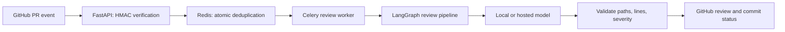

# AI Code Review Agent

A self-hosted GitHub App that turns pull-request diffs into inline review comments, a summary, and a commit status. Built with **Python, FastAPI, Celery, Redis, and LangGraph**, with five interchangeable model providers.

**Project status: experimental portfolio project.** Automated checks validate the software with mocked services. Live review quality and production recovery still need validation. AI feedback supplements human review and tests.

## Why I built this

I built this project to explore the engineering around an AI reviewer: secure webhook handling, GitHub App authentication, background jobs, structured model output, and provider choice. The interesting work is making the service handle failures clearly and keeping the choice of where code is processed explicit.

## Explore in five minutes

- [Architecture and trade-offs](docs/architecture.md): responsibilities, failure paths, and design decisions.
- [Offline demo](#run-the-offline-demo): inspect a sample diff and its review without credentials.
- [Review worker](src/worker.py), [webhook receiver](src/api/webhook.py), and [pipeline](src/agent/graph.py): the main implementation.
- [Tests](tests/) and [CI configuration](.github/workflows/ci.yml): verification, packaging, and container checks.
- [Readiness assessment](docs/readiness-assessment.md): verified evidence and remaining gaps.

## How it works



The worker fetches the diff, checks the PR revision before and after fetching and before publication, and runs six pipeline nodes: diff parsing, context retrieval, prompt validation, model review, response filtering, and summary generation.

| Engineering choice | What it demonstrates |
| --- | --- |
| HMAC signatures and bounded request bodies | Authenticate webhook deliveries and limit memory use |
| Atomic Redis claim scoped to repository, PR, and SHA | Suppress duplicate work during the one-hour claim window |
| Celery retries and revision checks | Keep slow inference outside the request and avoid known stale reviews |
| Validated model output | Only post findings on the reviewed file and valid right-side diff lines |
| Review payload reconciliation | Reuse an identical submitted review after a lost response |
| Locked dependencies and package checks | Make setup repeatable and verify runtime prompt assets |

Reviews run for `opened`, `synchronize`, and `reopened` events. Oversized diffs, invalid model responses, and provider failures produce an error rather than a clean result. Changes with no reviewable hunks are marked skipped with an error status.

## Run the offline demo

Requires Python 3.11+ and [uv](https://docs.astral.sh/uv/getting-started/installation/). From the repository root:

```bash
git clone https://github.com/Protagonist01/code-review-agent.git
cd code-review-agent
uv sync --locked --extra dev
uv run --locked code-review-demo
```

The demo runs the parser, packaged prompt, response validation, and summary generation using a **recorded model response**. It makes no GitHub or provider calls. It demonstrates pipeline behavior, not model accuracy.

Example finding:

```text
calculator.py:3 | ERROR | Guard against an empty list before dividing.
```

A standard pip install is also supported: `python -m pip install -e ".[dev]"`, then `python -m src.demo`. This resolves dependencies afresh; use the lockfile workflow for the tested dependency set.

## Run real GitHub reviews

Requires Docker Compose, a GitHub App installed on a test repository, and a configured model provider.

1. Copy `.env.example` to `.env` (`cp .env.example .env`, or `Copy-Item .env.example .env` in PowerShell).
2. Set `GITHUB_APP_ID`, `GITHUB_WEBHOOK_SECRET`, and the provider API key. Save the App private key at `keys/private-key.pem`. Never commit credentials.
3. Grant repository permissions: Contents (read), Pull requests (read/write), and Commit statuses (read/write). Subscribe to Pull request events.
4. Set `LLM_PROVIDER` and its model. Example model IDs must be checked against the provider's available models.
5. Start the core services:

```bash
docker compose --env-file .env -f infra/docker-compose.yml up --build -d redis api worker
```

Configure the App webhook URL as `https://YOUR_HOST/webhook` with the same secret. For local testing, use an HTTPS tunnel to `http://localhost:8000`. Tunnel software is installed separately. Public hosting needs an HTTPS proxy that exposes only `/webhook` and limits request size and rate; see [deployment guidance](docs/deployment.md).

| Provider | `LLM_PROVIDER` | Configuration |
| --- | --- | --- |
| OpenRouter | `openrouter` | `OPENROUTER_API_KEY`, `OPENROUTER_MODEL` |
| Ollama | `ollama` | `OLLAMA_BASE_URL`, `OLLAMA_MODEL` |
| Groq | `groq` | `GROQ_API_KEY`, `GROQ_MODEL` |
| OpenAI | `openai` | `OPENAI_API_KEY`, `OPENAI_MODEL` |
| Anthropic | `anthropic` | `ANTHROPIC_API_KEY`, `ANTHROPIC_MODEL` |

Hosted providers receive diff and repository context. A local Ollama endpoint keeps inference on your infrastructure; the application still communicates with GitHub. On Docker Desktop, use `OLLAMA_BASE_URL=http://host.docker.internal:11434` and pull the configured model on the host. Other Docker hosts need a reachable Ollama address.

## Verification and development

```bash
uv run --locked pytest
uv run --locked ruff check src tests evals scripts
uv run --locked ruff format --check src tests evals scripts
uv run --locked mypy src
uv build --no-sources
uv run --locked python scripts/check_artifacts.py
```

The suite enforces at least 80% source line coverage. CI is configured for Python 3.11 and 3.13, dependency auditing, wheel installation outside the checkout, and container readiness. These are workflow definitions; see the assessment for checks actually executed.

The wheel includes the versioned prompt and offline demo. The source archive includes tests and operational configuration. Credentials, local tools, caches, editorial images, and generated results are excluded.

## Model evaluation

```bash
uv run --locked python -m evals.run_evals --backend ollama
```

The ten example cases exercise real inference without GitHub access. The runner records provider/model, matches findings by file, line, severity, and message pattern, and reports precision, recall, run completion, and p95 latency. A failed threshold returns a failing exit code. Hosted calls can incur costs. These patterns and a small dataset do not establish real-world model accuracy.

## Operations and limits

- `/health` checks that the API is running. `/ready` checks API-to-Redis connectivity; it does not check workers, GitHub, or the model.
- Ports bind to localhost. Containers run as a non-root user; keys are mounted read-only and Redis data persists in a volume.
- Monitoring is optional. Set a strong `GRAFANA_ADMIN_PASSWORD` in `.env`, then run `docker compose --env-file .env -f infra/docker-compose.yml --profile monitoring up -d`.
- `/metrics` exposes API-process metrics. Worker counters are not aggregated, token usage is not recorded, and alert delivery is not configured. Dashboard panels for those signals need separate instrumentation.
- Concurrent jobs or changed model output on retries can duplicate reviews. Revision checks reduce stale publication but do not make the final GitHub write atomic.
- Reviews are per-hunk. Deleted files, generated files, binaries, and other unsupported changes can be omitted. Cross-file reasoning and prompt-injection resistance are not established.

See the [run cheat sheet](docs/run-cheatsheet.md), [contributing guide](CONTRIBUTING.md), [security policy](SECURITY.md), and [build book](BUILD_BOOK.md).

## License

[MIT](LICENSE).
