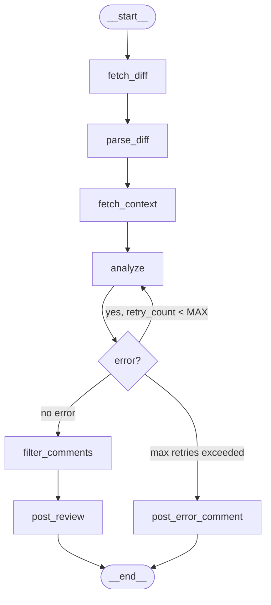

# Architecture — AI Code Review Agent

## Overview

The **AI Code Review Agent** is an event-driven service that automatically
reviews GitHub pull requests using a multi-node LangGraph state machine backed
by a pluggable LLM provider (OpenRouter, Ollama, Groq, OpenAI, or Anthropic).

When a `pull_request` webhook fires, the FastAPI gateway enqueues a Celery
task. The Celery worker invokes the LangGraph graph, which orchestrates
diff fetching → context retrieval → LLM analysis → comment posting in a
structured, retry-aware pipeline.

---

## LangGraph State Machine



### Node Descriptions

| Node | Responsibility |
|------|---------------|
| `fetch_diff` | Downloads the raw unified diff for the PR via the GitHub API (App auth or PAT). Stores it in `state.raw_diff`. |
| `parse_diff` | Splits `raw_diff` into `DiffHunk` objects — one per file-chunk — and populates `state.hunks`. |
| `fetch_context` | Retrieves repository context: primary language, abbreviated README, and top-level file tree. Stored in `state.repo_context`. |
| `analyze` | Sends each hunk to the configured LLM with a structured prompt. Parses the response into `ReviewComment` objects and accumulates them in `state.review_comments`. Also sets `state.summary` and `state.severity`. |
| `filter_comments` | Removes comments below `settings.min_comment_severity` and deduplicates near-identical messages. |
| `post_review` | Calls the GitHub Reviews API to submit all comments as a single review in `COMMENT` mode. |
| `post_error_comment` | Posts a polite error message on the PR when all retries are exhausted. |

---

## Data Flow

```
GitHub Webhook
      │
      â–¼
┌─────────────┐    HMAC-SHA256    ┌──────────────────┐
│  FastAPI    │◄──── verified ────│  GitHub Platform │
│  /webhook   │                   └──────────────────┘
└──────┬──────┘
       │ enqueue task
       â–¼
┌─────────────┐     Redis      ┌─────────────────┐
│   Celery    │◄──────────────►│    Redis Broker  │
│   Worker    │                └─────────────────┘
└──────┬──────┘
       │ ainvoke
       â–¼
┌─────────────────────────────┐
│       LangGraph Graph       │
│  fetch_diff → parse_diff    │
│  → fetch_context → analyze  │
│  → filter → post_review     │
└──────────────┬──────────────┘
               │ GitHub Reviews API
               â–¼
        Pull Request Review
```

---

## LLM Backend Abstraction

The `analyze` node delegates to a provider factory in `src/agent/llm_backend.py`
that returns an `LLMBackend` implementation based on `settings.llm_provider`:

| Provider | Model | Config keys |
|----------|-------|-------------|
| `openrouter` | `cohere/north-mini-code:free` | `OPENROUTER_API_KEY`, `OPENROUTER_MODEL`, `OPENROUTER_BASE_URL` |
| `groq` | `llama-3.3-70b-versatile` | `GROQ_API_KEY`, `GROQ_MODEL` |
| `ollama` | `codellama:7b` | `OLLAMA_BASE_URL`, `OLLAMA_MODEL` |
| `openai` | `gpt-4o-mini` | `OPENAI_API_KEY`, `OPENAI_MODEL` |
| `anthropic` | `claude-haiku-4-5` | `ANTHROPIC_API_KEY`, `ANTHROPIC_MODEL` |

Provider-specific imports live behind the backend factory, so swapping
backends requires changing a single env variable - no code changes.

where `ReviewOutput` is a Pydantic v2 model. This guarantees the LLM response
is always parseable into typed `ReviewComment` objects.

---

## Async Processing (Celery + Redis)

```
FastAPI (sync route)
  └── enqueue_review_task.delay(owner, repo, pr_number, …)
                │
                â–¼
        Redis list (queue: "reviews")
                │
                â–¼
        Celery worker process
          └── asyncio.run(review_graph.ainvoke(state))
```

- The FastAPI webhook handler returns **202 Accepted** immediately after
  enqueueing, so GitHub receives a fast acknowledgement within its 10-second
  window.
- The Celery worker runs the fully-async LangGraph graph inside
  `asyncio.run()` on a dedicated OS thread-pool worker.
- Task result and error state are persisted in Redis so Flower can
  display them, and retries are handled at the **LangGraph node level** (not
  the Celery level) for fine-grained control.

---

## Observability

### Metrics (Prometheus)

The FastAPI app exposes `/metrics` (via `prometheus_fastapi_instrumentator`
plus custom `prometheus_client` counters/histograms):

| Metric | Type | Description |
|--------|------|-------------|
| `review_duration_seconds` | Histogram | End-to-end latency per review |
| `review_comments_total` | Counter | Comments posted, labelled by `severity` |
| `active_reviews` | Gauge | In-flight review tasks |
| `webhook_errors_total` | Counter | Webhook processing errors by `error_type` |
| `llm_tokens_total` | Counter | LLM tokens consumed |
| `reviews_completed_total` | Counter | Successfully completed reviews |

### Alerting (Prometheus Alertmanager)

Three alert rules are defined in `infra/prometheus/alert_rules.yml`:

- **ReviewLatencyHigh** — p95 > 60 s for 5 min → `warning`
- **WebhookErrorRateHigh** — error rate > 5% → `critical`
- **ActiveReviewsStuck** — > 10 in-flight for 10 min → `warning`

### Dashboards (Grafana)

The pre-built Grafana dashboard (`infra/grafana/dashboard.json`) provides
six panels covering latency percentiles, comment severity breakdown, active
reviews gauge, webhook error trends, LLM token consumption, and review
throughput. It auto-provisions from the `infra/grafana/provisioning/`
directory and connects to Prometheus via the `DS_PROMETHEUS` datasource variable.

### Structured Logging

All components use `structlog` with JSON output (when `LOG_JSON=true`) for
machine-parseable logs. Key log events include:

- `webhook.received` — raw GitHub event metadata
- `review.started / review.completed / review.failed` — task lifecycle
- `llm.invoke` — provider, model, token counts, latency
- `github.post_review` — comment count and PR reference
