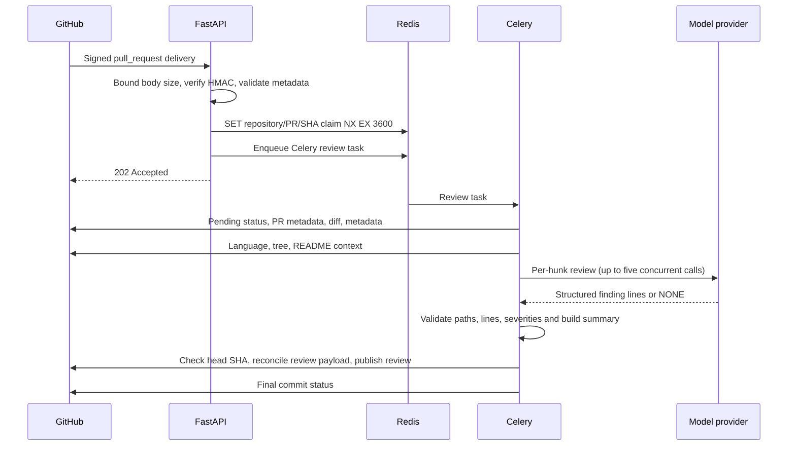
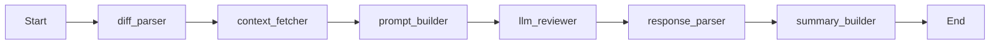

# Architecture

The API accepts signed GitHub events and queues work. The worker owns GitHub reads and writes. The LangGraph pipeline converts a diff and repository context into validated review findings.

## Runtime boundaries

The claim is scoped to repository, pull request, and commit SHA. Dispatch failure attempts to release it and returns 503. A broker acknowledgement can be lost after enqueueing, so this is duplicate suppression, not exactly-once execution.

## Pipeline

| Node | Responsibility |
| --- | --- |
| `diff_parser` | Parse supported text hunks, infer language, skip generated/noise files, reject oversized diffs |
| `context_fetcher` | Fetch repository language, top-level tree and a 500-character README excerpt; fall back to empty context on errors |
| `prompt_builder` | Load and cache the versioned prompt; assemble each hunk's prompt |
| `llm_reviewer` | Use the configured backend with a five-call semaphore and a 30-second timeout per hunk |
| `response_parser` | Filter findings by minimum severity after validating file and right-side line positions |
| `summary_builder` | Render a summary and choose the highest remaining severity |

`ReviewState` is a typed dictionary. Hunk, context, and finding models use Pydantic. The graph has no conditional retries or checkpoint storage. Celery retries the whole task up to three times with backoff.

`build_graph(fetch_context=False, backend=...)` supports isolated demos and evaluations. Production defaults still fetch context and use the configured real backend. The demo injects a recorded response. Evaluations skip GitHub context and use actual model inference.

## Authentication and publication

Webhook authentication uses HMAC-SHA256 and constant-time comparison. GitHub API authentication uses short-lived App JWTs exchanged for installation tokens; a PAT alternative exists for local development. Restrict the App to test repositories while validating behavior.

The worker checks the head SHA before fetching the diff, after fetching, and before publishing. A newer revision produces an error status on the obsolete commit and no review. There is still a race between the final check and the remote write.

Review publication hashes the intended payload and adds a hidden marker. Before posting, the client searches paginated reviews for the same marker and commit. An identical submitted payload is reused. Concurrent workers and different model output on retry can still duplicate reviews.

## Failure behavior

Invalid signatures return 403; malformed relevant payloads return 400; oversized requests return 413; Redis or dispatch failures return 503. Unsupported events and duplicate claims return 200. Accepted jobs return 202.

Model errors and invalid results fail the task. Empty supported-hunk coverage is marked skipped, not clean. Fetch or publication failures attempt an error commit status before being re-raised for Celery retry. Error-status failure is logged without masking the original failure.

## Observability

The API configures structured access logs with request IDs. `/health` is a liveness check. `/ready` pings Redis; it does not prove the worker, GitHub, or provider is ready.

`/metrics` exports the API process registry. `webhook_requests_total` and `webhook_errors_total` support API error-rate monitoring. Worker code updates `active_reviews`, `review_duration_seconds`, `comments_posted_total`, and `reviews_completed_total` in separate processes; the API scrape does not collect those updates. `llm_tokens_used_total` is declared but not instrumented.

Prometheus rules and a Grafana dashboard are supplied as an optional monitoring profile. Worker panels are scaffolding until worker metrics collection is implemented. Alertmanager and Loki are not configured.

## Design records

- [Original local-inference decision](adr/001-local-llm-via-ollama.md), superseded by the provider strategy.
- [Current provider strategy](adr/004-llm-backend-strategy.md).
- [Why LangGraph](adr/002-langgraph-vs-custom-loop.md).
- [Why Celery and Redis](adr/003-async-celery-redis.md).
- [Build book](../BUILD_BOOK.md) for implementation and failure diagnosis.
